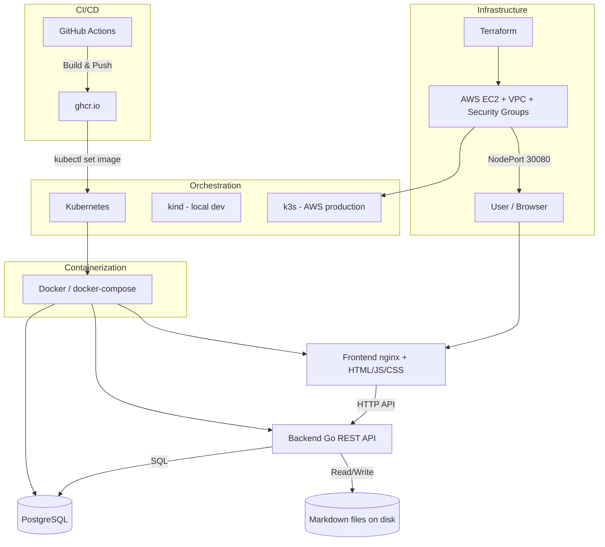

# Project Architecture

This document describes the architecture of the Markdown Knowledge Base project.

## System Overview

## Tech Stack

| Layer | Technology |
|-------|-----------|
| Backend | Go, chi router, pgx/v5 |
| Frontend | HTML, CSS, JavaScript, marked.js, highlight.js, Mermaid |
| Database | PostgreSQL 16 |
| Container | Docker, docker-compose |
| Local Kubernetes | kind |
| Cloud Kubernetes | k3s on AWS EC2 |
| Infrastructure as Code | Terraform (AWS) |
| CI/CD | GitHub Actions, ghcr.io |

## Data Flow

1. User opens the frontend in the browser
2. Frontend loads the document list via `GET /documents`
3. Clicking a document fetches its content via `GET /documents/{id}`
4. Content is rendered from Markdown to HTML client-side using marked.js
5. Creating or editing sends `POST` or `PUT` requests
6. Backend stores metadata in PostgreSQL and content as `.md` files on disk

## Deployment Environments

| Environment | Command | URL |
|-------------|---------|-----|
| Local (Docker) | `docker compose up -d` | http://localhost:8085 |
| Local (kind) | `kubectl apply -n markdownkb -k kubernetes/` | http://localhost:30080 |
| AWS (k3s) | `KUBECONFIG=terraform/kubeconfig.yaml kubectl apply -n markdownkb-aws -k kubernetes/` | http://63.178.0.65:30080 |
